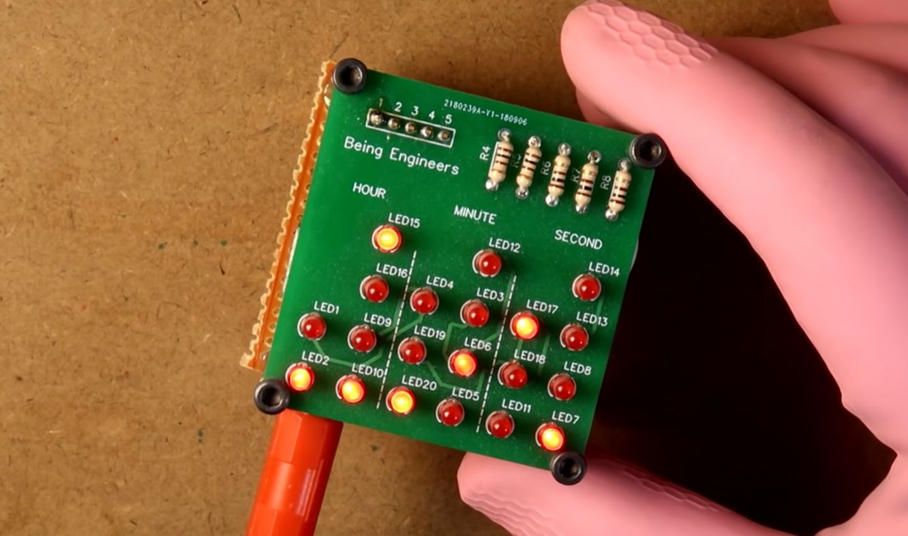

# nano-binary-clock
Hey guys, In this project I have showed how you can make a DIY binary clock with arduino. Most of the binary clocks don't have seconds, because of the limited number of I/O ports available in arduino. But in this project I have make this clock to show us the time in HH : MM : SS format with the help of 20 leds. The interesting fact is that I used only 5 pins from arduino to make this happen. This concept is called charlieplexing. Previously I have uploaded a video on this topic. If you don't know about it then do watch it and then start from here.

